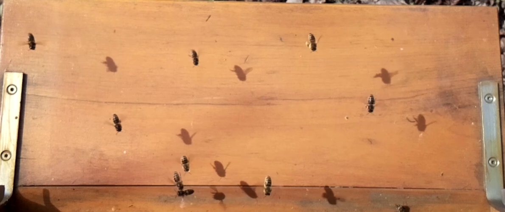
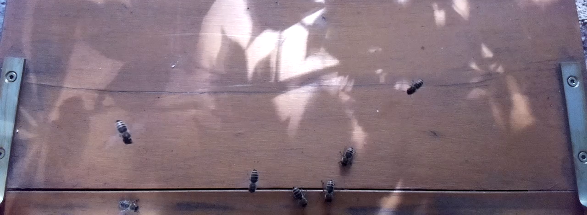
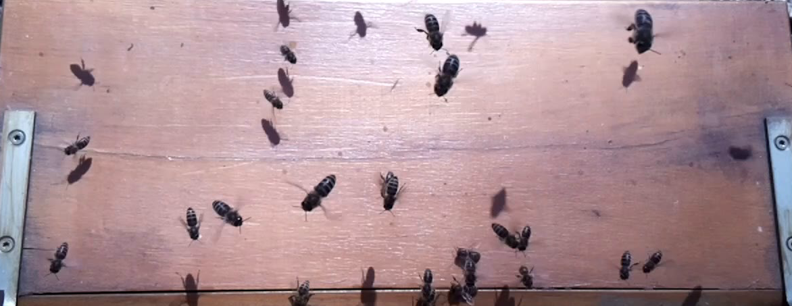
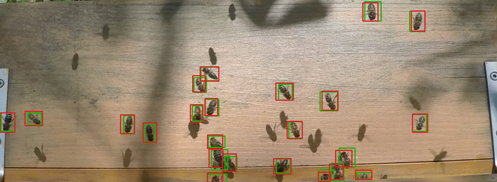
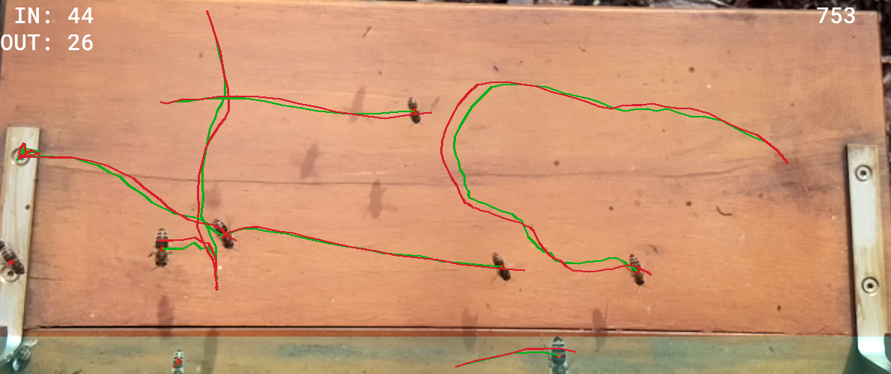

  <h1>BeeMeter</h1>
  <h6>Count bee traffic using a deep convolutional neural network</h6>

This project implements a system for analyzing bee traffic, which is the number of bees that either leave or enter 
the hive. There are already approaches based on sensors (e.g. RFID chips or phototransmitters) or with the help of a 
camera and methods from computer vision, such as background subtraction and contour recognition. Here, a deep learning 
approach is implemented. In the first step, the bees are detected with a CNN and in the second step they are tracked 
over a sequence of images until they reach a counting zone. 

The system is to run on the [Nvidia Jetson Nano](https://developer.nvidia.com/embedded/jetson-nano-developer-kit) 
directly at the hives and analyze the data immediately.

### Features

* Realtime detection
* High accuracy
* No artificial background or light source necessary
* Executable on a small single-board computer (Nvidia Jetson Nano)
* Easily expandable by sensors e.g. load cells, microphones etc.

### Challenges:

There are several reasons why detecting and tracking bees is a difficult problem:

* Beehives are located in nature and are exposed to **changing light conditions** due to weather and time of day or
  season. As a result, colors and brightness vary constantly. In addition, the bees themselves, the mounted camera and
  surrounding trees constantly cast shadows into the image. The latter can have a major influence depending on the
  location and weather.

* A single bee captured by the camera in front of the entrance is a **very small object** compared to the image size.
  Additionally, the **movement** of each bee before the entrance is very different. Some sit on the spot, crawling
  around slowly, others fly, take off or land quickly, or still others buzz around. The movement seems quite random and
  sometimes so fast that an appropriate frame rate is necessary.

* Bees tend to form **groups** before they fly in, which makes it difficult to identify individuals. In addition,
  overlapping can occur due to the camera position from above. These effects are significantly amplified at the peak of
  the season.
  
---

Here are three examples in different scenarios:

  
  
  

### [Detection](detection)
For bee detection, a CNN was trained using a newly annotated dataset. The [Single Shot MultiBox Detector](https://arxiv.org/abs/1512.02325) 
is used as architecture and is lightly modified. The efficient [MobileNetV2](https://arxiv.org/abs/1801.04381) 
is used as the base network. Detection can easily run in 60 FPS and achieves accuracy of about 94%.

  

### [Tracking](tracking)
After the bees have been detected on one frame, they must now be assigned to the same instance on the next frame. 
For this purpose, a path object is introduced that represents the trajectory of a bee. New bees are assigned to this 
object by solving the Linear Sum Assignment. This way the bees are assigned according to the distance from the previous
position. To improve this, the next position of a bee is estimated using a Kalman filter.

  

### Usage
The project is divided into different modules:
* *detection*: Train and test the object detection models with the SSD architecture and different base network
* *tracking*: Combine the detection and tracking algorithm to analyse the Bee traffic.
* *jetson_nano*: Converts the model using TensorRT and prepares it for use on the Jetson Nano.

#### Models and Data
The model and training data can be found [here](https://drive.google.com/drive/folders/1JhJU4DZTG9jm2EDTVsalm5BQ1a-bDN43?usp=sharing).

#### Requirements
For the requirements of this project use the requirements.txt file.

